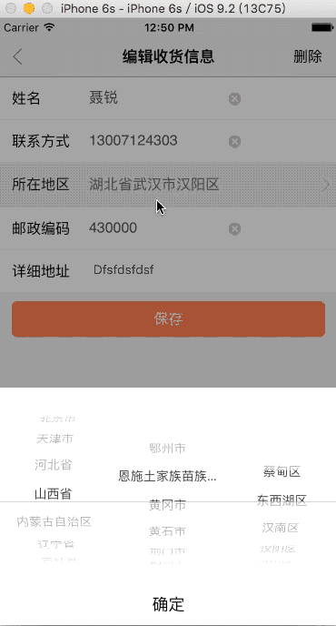

# NRCityPickerView
Objective-C 城市选择器, 省 市 区 三级联动,附带邮政编码.

# Usage

1. 将region.plist,NRCityPickerView.h,NRCityPickerView.m导入工程;

2. 使用 `- (void)setProvince:(NSString *)province city:(NSString *)city district:(NSString *)district`
  传入初始化省 ,市 ,区;

3. 实现代理: `- (void)didCityPickerPickedWithProvice:(NSString *)province city:(NSString *)city district:(NSString *)region postCode:(NSString *)postCode;`

#PreView

